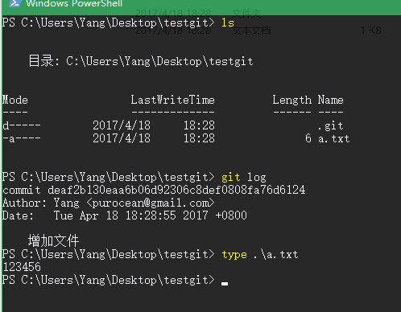
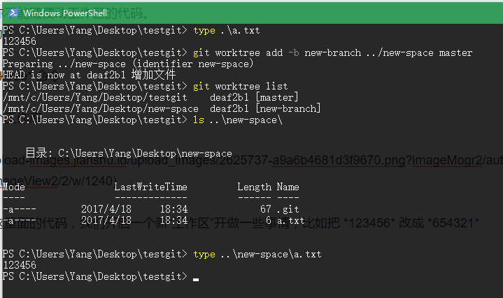
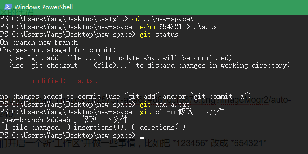
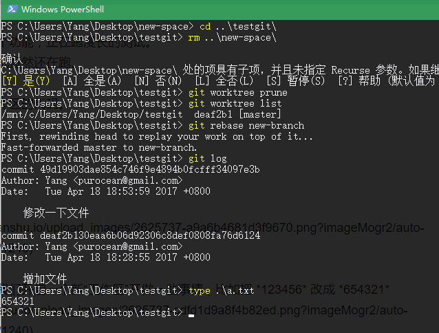

---
tags:
  - Git
---

# Git worktree 的使用

假设这样一个场景，你做完了一个功能，正在跑漫长的测试。
喝茶，上厕所，回来一看，这测试竟然还在跑。
闲着也是闲着，修复下 bug 吧。
但是测试跑着，你不能随便动工作区的代码。
这时候应该怎么办？

答：使用 *git worktree* 命令

假设你有这样一个工作库：

现在，我们不动这里面的代码，我们开启一个新“工作区”开做一些事情，比如把 *123456* 改成 *654321*

好啦，我们几乎在 *../new-space**里面搞了一个当前工作区的副本。
现在开始修改里面的文件。

文件修改完成了，漫长的测试也跑完了，一次性通过，真棒！
现在就需要把 *new-space* 里面的 *new-branch* 分支合并到“主树”

